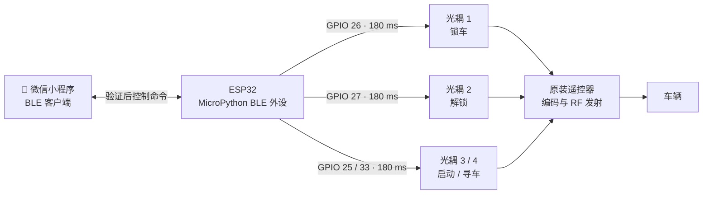
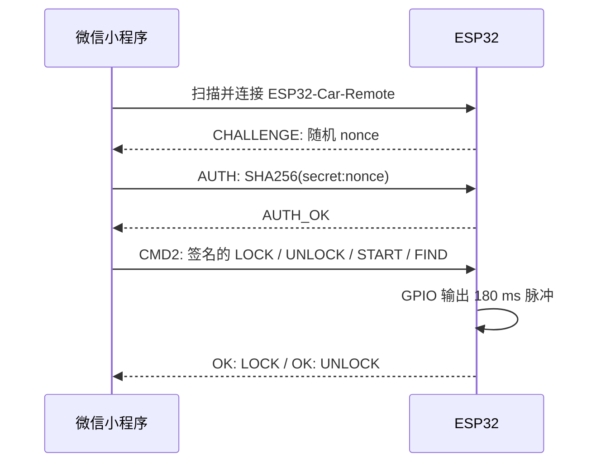

# ESP32 微信小程序 BLE 遥控器

<p align="center"><strong>微信小程序 → BLE → ESP32 → 光耦 → 原装遥控器按键</strong><br>用手机近距离模拟锁车、解锁、启动与寻车短按。</p>

> [!WARNING]
> 仅用于你有权控制的设备。本项目不读取、复制或重放射频码；原装遥控器仍负责滚动码和无线发射。不要接入一键启动等高风险功能。

## 架构



ESP32 与遥控器只有光耦的光学通路，二者**不共地**；ESP32 不参与射频编码。

## 安全流程



连接或断开**不会**自动触发操作：手机蓝牙可能瞬断，明确点按更可靠。

## 硬件接线

每个按键需要独立光耦通道；PC817 或四路 TLP281-4 均可。

```text
ESP32 GPIO 26 ── 330 Ω ──►| PC817 LED |── ESP32 GND
遥控器“锁车”焊盘 A ────── C  PC817  E ────── 遥控器“锁车”焊盘 B

ESP32 GPIO 27 ── 330 Ω ──►| PC817 LED |── ESP32 GND
遥控器“解锁”焊盘 A ────── C  PC817  E ────── 遥控器“解锁”焊盘 B

ESP32 GPIO 25 / 33 ── 330 Ω ──►| PC817 LED |── ESP32 GND
遥控器“启动 / 寻车”焊盘 A ── C  PC817  E ── 遥控器对应焊盘 B
```

| 功能 | ESP32 GPIO | 光耦晶体管跨接 |
| --- | ---: | --- |
| 锁车 / 设防 | 26 | 锁车键两块焊盘 |
| 解锁 / 解防 | 27 | 解锁键两块焊盘 |
| 启动 / 闪电键 | 25 | 启动键两块焊盘 |
| 寻车 / 喇叭键 | 33 | 寻车键两块焊盘 |

先用万用表确认按下时导通的焊盘。对于矩阵键盘，不能假设某端为 GND。

> [!CAUTION]
> 遥控器侧绝不能与 ESP32 GND 相连；也不要从遥控器纽扣电池给 ESP32 供电。

## 目录

```text
firmware/main.py       ESP32 MicroPython BLE GATT 服务
miniprogram/           微信小程序（搜索、连接、验证与控制）
LICENSE                MIT 开源许可证
```

## 快速开始

1. 创建 `firmware/pairing_config.py`，填写至少 32 字符的随机密码：`BLE_PAIRING_SECRET = "..."`；此文件已被忽略，不会提交。
2. 将 [`firmware/main.py`](firmware/main.py)、[`firmware/security.py`](firmware/security.py) 与该配置上传到 ESP32 MicroPython 根目录并运行。
3. 用微信开发者工具导入 [`miniprogram/`](miniprogram/)；在小程序密码框输入相同密码（不写入源码）。
5. 使用真机预览，授予蓝牙/附近设备权限，连接并等待“已验证，可操作”。

> 微信开发者工具不能模拟 BLE，必须使用真实手机测试。

## BLE 服务

| 项目 | UUID / 内容 |
| --- | --- |
| 自定义服务 | `6e400001-b5a3-f393-e0a9-e50e24dcca9e` |
| 命令（Write） | `6e400002-b5a3-f393-e0a9-e50e24dcca9e` |
| 状态（Read/Notify） | `6e400003-b5a3-f393-e0a9-e50e24dcca9e` |
| 认证 | `HELLO2` → `AUTH2:HMAC-SHA256(...)` |
| 控制 | 带会话、序号与 HMAC 的 `CMD2` 指令 |

## 安全建议

- BLE 广播名称不是身份验证；使用长而唯一的配对密钥。
- 挑战响应避免复用旧认证消息，但它不是车规数字钥匙。
- 不要将控制接口暴露到公网；更高要求应增加 BLE 加密、硬件安全元件与距离测量。

## 许可证

[MIT License](LICENSE)
