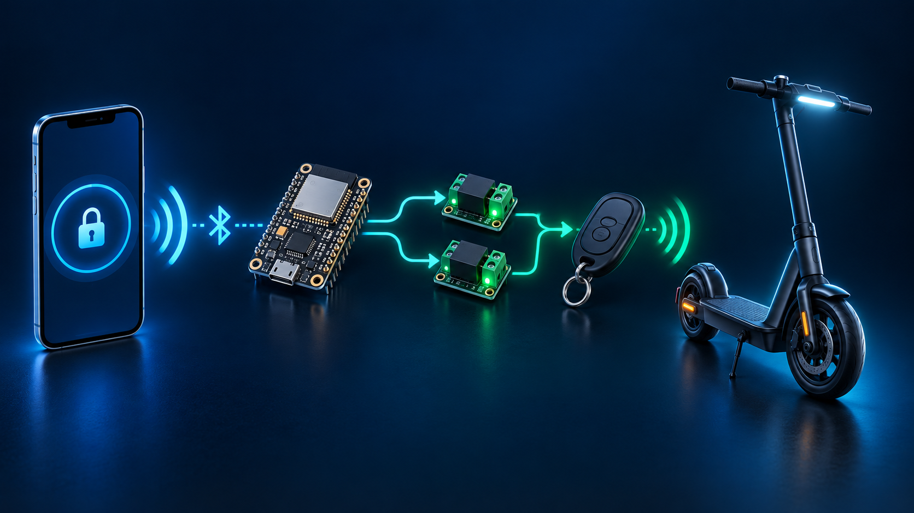
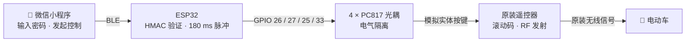
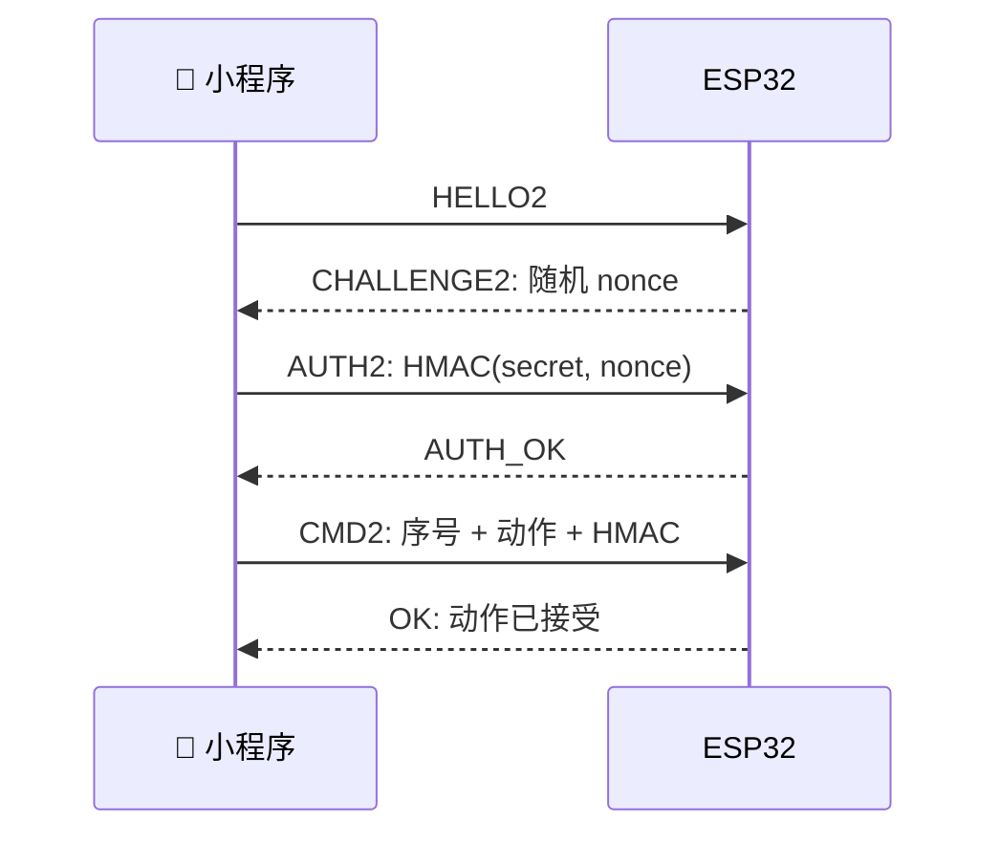

<p align="center"></p>

<h1 align="center">电动车手机遥控钥匙</h1>
<p align="center"><strong>低成本、低复杂度：微信小程序 → BLE → ESP32 → 光耦 → 原装遥控器 → 电动车</strong></p>
<p align="center"></p>

> [!WARNING]
> 仅用于你有权控制的设备。项目只模拟原遥控器物理按键，不读取、复制或重放射频码；请勿接入一键启动等高风险功能。

## 你可能遇到的问题

你希望不用天天带物理遥控钥匙，却又不想拆解、复制或研究车辆的射频协议。若电动车后备箱本身是密码锁，可把这套设备与原遥控器一起放进后备箱：出门只带手机，需要时用小程序控制车辆。

本项目只做一件事：**以低成本、低复杂度保留原装遥控器的编码和发射能力，让 ESP32 通过光耦模拟真人短按。**

| 常见做法 | 本项目 |
| --- | --- |
| 复制或重放 RF，易遇滚动码问题 | 原遥控器继续处理 RF |
| ESP32 与遥控器共地 | 每个按键独立光耦隔离 |
| 蓝牙一连接就自动开锁 | 明确点按，避免瞬断误动作 |
| 设备名或 MAC 作为身份 | HMAC、随机挑战、序号防重放 |

### 推荐放置方式

```text
后备箱（密码锁）
├── 原装遥控器：仍负责滚动码和 RF 发射
└── ESP32 + 4 路光耦：由独立电源供电，连接遥控器按键焊盘

随身携带
└── 手机：微信小程序近距离 BLE 控制
```

后备箱密码是物理访问的第一道保护；请设置独立、可靠的密码，并妥善固定 ESP32 和遥控器，避免行驶震动导致接线松脱。

## 工作架构



支持四路短按：**锁车、解锁、启动（闪电键）、寻车（喇叭键）**；同一时刻只允许一路输出。手机就是日常遥控入口，原装遥控器保留在后备箱内。

## 三分钟上手

### 1. 接线

每个按键使用独立 PC817：GPIO 经 330 Ω 接光耦 LED 输入；晶体管侧跨接遥控器对应的两块焊盘。

| 动作 | 普通 ESP32 | ESP32-S3 |
| --- | ---: | ---: |
| 锁车 | GPIO 26 | GPIO 4 |
| 解锁 | GPIO 27 | GPIO 5 |
| 启动 | GPIO 25 | GPIO 6 |
| 寻车 | GPIO 33 | GPIO 7 |

详细接线与测量方法见 [固件接线指南](firmware/README.md#接遥控器，同时保留-led当前接线图)。**遥控器侧绝不能与 ESP32 GND 相连，也不要用其纽扣电池为 ESP32 供电。**

### 2. 修改默认密码

[`firmware/pairing_config.py`](firmware/pairing_config.py) 的默认密码是 `dangerous`，仅供联调，公开可见且不安全。刷入前务必按需修改：

```python
BLE_PAIRING_SECRET = "替换为至少 32 位随机长密码"
```

随后在小程序密码框输入同一密码；密码不写入小程序源码或日志。这样即使有人在附近发现设备，也不能直接发送控制命令。

### 3. 刷入与连接

1. 上传 `firmware/main.py`、`firmware/security.py`、`firmware/pairing_config.py` 到 ESP32 MicroPython 根目录。
2. 微信开发者工具导入 [`miniprogram/`](miniprogram/)，真机预览并允许蓝牙/附近设备权限。
3. 连接 `ESP32-Car-Remote`，认证成功后使用按钮。

> 微信开发者工具不能模拟 BLE，必须在真实手机验证。

## 安全模型



- 每连接独享挑战与认证，15 秒未认证自动断开。
- 每条命令绑定会话、动作和递增序号，防篡改与重放。
- 连续失败会冷却；5 分钟无操作自动断开。
- HMAC 不等同车规数字钥匙；更高要求应加入 BLE 加密、硬件安全元件和距离测量。

## 项目结构与测试

```text
firmware/       ESP32 MicroPython、接线资料、3D 外壳、回归测试
miniprogram/    微信小程序与 HMAC 安全测试
docs/hero.png   README 主视觉图
```

```bash
python3 -m unittest discover -s firmware/tests
node miniprogram/tests/security.test.js
```

## License

[MIT](LICENSE)
