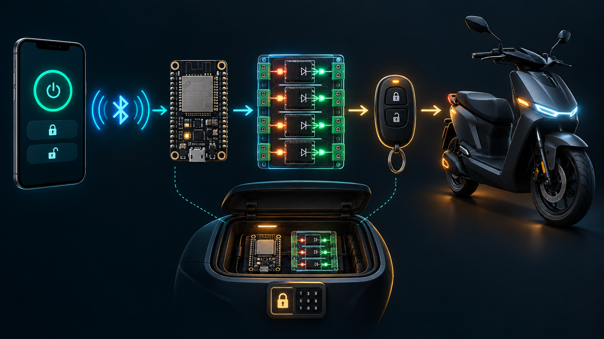

# 工作原理与部署指南

## 信号与电气边界

1. 微信小程序以 BLE 连接、挑战认证和签名指令控制 ESP32。
2. ESP32 仅把已验证指令变成 GPIO 的 180 ms 脉冲。
3. 每路 GPIO 驱动一颗 PC817；输出侧短接遥控器一组按键焊盘。
4. 原装遥控器用原电池、原滚动码和 RF 模块与车辆通信。

手机不直接处理车辆射频；ESP32 与遥控器也不共地。设备可固定在密码锁后备箱，手机承担日常遥控钥匙角色。

## 推荐让 AI 协助部署

推荐把仓库链接、ESP32 板型与遥控器按键照片交给可信 AI 编程代理，协助检查引脚、生成随机密码、上传文件、运行测试和解释串口日志。

AI 不应猜测遥控器焊盘、提交真实密码，或在你未确认前触发车辆控制。焊接前必须由你用万用表验证触点；首次仅验证 LED 与光耦脉冲。
