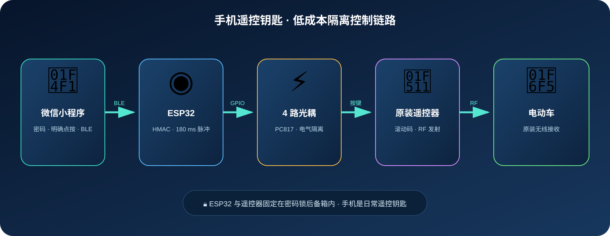

# 工作原理与完整部署指南



## 工作原理

手机只通过 BLE 向 ESP32 发出经过认证的控制请求。ESP32 验证 HMAC 后，对相应 GPIO 输出 180 ms 脉冲；PC817 的晶体管侧模拟原遥控器按键。遥控器仍用自身电池、滚动码与 RF 模块控制车辆，因此无需研究或复制 RF 协议。

设备和原遥控器可固定在密码锁后备箱中；ESP32 与遥控器不共地，并使用独立电源。

## 0. 需要准备

- ESP32 DevKit（普通 ESP32 或 ESP32-S3）、数据 USB 线、电脑。
- 4 路 PC817、8 个 330 Ω 电阻、绝缘导线与独立 ESP32 电源。
- 已安装 Python 3.10+；首次刷写会清空 ESP32 flash 中的已有文件。

## 1. 安装电脑工具

在终端执行：

```bash
python3 -m pip install --upgrade esptool mpremote
git clone https://github.com/zgfh/esp32-wechat-ble-remote.git
cd esp32-wechat-ble-remote
```

macOS 可用 `ls /dev/cu.*` 查找串口；Linux 常见为 `/dev/ttyUSB0` 或 `/dev/ttyACM0`；Windows 常见为 `COM3` 之类。下文将它替换为 `PORT`。

## 2. 下载正确的 MicroPython 固件

从官方页面下载最新**稳定版** `.bin`：

| 板型 | 官方下载页 | 备注 |
| --- | --- | --- |
| 普通 ESP32/WROOM | [ESP32_GENERIC](https://micropython.org/download/ESP32_GENERIC/) | 绝大多数 4MB+ 普通 ESP32 |
| ESP32-S3 | [ESP32_GENERIC_S3](https://micropython.org/download/ESP32_GENERIC_S3/) | 有 Octal PSRAM 时选择页面中的 spiram-oct 变体 |

不要下载 ESP32-S2 固件：它没有 BLE。若不确定芯片型号，先查看开发板丝印或让 AI 根据照片协助确认。

## 3. 擦除并刷入固件

按住开发板的 **BOOT** 键并插入 USB（部分板不需要），然后：

```bash
# 普通 ESP32：替换 PORT 和下载的文件名
esptool --chip esp32 --port PORT erase_flash
esptool --chip esp32 --port PORT --baud 460800 write_flash 0x1000 ESP32_GENERIC-xxxx.bin
```

S3 请把 `--chip esp32` 改为 `--chip esp32s3` 并使用下载页给出的烧录地址。若 460800 波特率失败，移除 `--baud 460800` 后重试。官方 ESP32 通用固件刷写地址为 `0x1000`；请始终以你下载的板型页面说明为准。

## 4. 配置密码并上传程序

编辑 `firmware/pairing_config.py`。默认 `dangerous` 仅用于联调，实际使用前必须改成至少 32 字符随机密码：

```python
BLE_PAIRING_SECRET = "替换为随机长密码"
```

上传三个文件；这会在设备根目录创建/替换同名文件：

```bash
mpremote connect PORT fs cp firmware/main.py :main.py
mpremote connect PORT fs cp firmware/security.py :security.py
mpremote connect PORT fs cp firmware/pairing_config.py :pairing_config.py
mpremote connect PORT reset
mpremote connect PORT repl
```

串口看到 `BLE ready` 与广播日志即表示固件已启动。先不要接遥控器，先用 LED/光耦输入侧确认四路 GPIO 脉冲正确。

## 5. 导入微信小程序

1. 用微信开发者工具导入仓库 `miniprogram/` 目录，使用自己的 AppID 或测试号。
2. 真机预览，允许蓝牙与附近设备权限。
3. 搜索 `ESP32-Car-Remote`，在密码框输入第 4 步的同一密码。
4. 等待“已验证”，再测试按钮。开发者工具本身不能模拟 BLE。

## 推荐让 AI 协助安装、部署和运行

推荐把本仓库链接、你的操作系统、ESP32 板型和遥控器按键照片交给可信 AI 编程代理。它可以协助选择固件、生成命令、检查串口、上传文件、运行测试和解释日志。

请明确要求 AI：**不提交真实密码、不猜测遥控器焊盘、未获确认前不触发车辆控制**。焊接前必须由你用万用表验证每一组触点。

## 排查

| 症状 | 优先检查 |
| --- | --- |
| `Failed to connect` | 换数据线；按住 BOOT；确认串口与芯片参数 |
| 刷写中断 | 去掉高速波特率后重试 |
| 手机找不到设备 | 重启板子；确认下载的是 BLE 支持的 ESP32/ESP32-S3 固件 |
| 小程序认证失败 | 两端密码是否完全相同；默认 `dangerous` 是否已被修改 |
| GPIO 正常但车辆无响应 | 断电后用万用表确认按键焊盘和 PC817 输出侧，不要接 ESP32 GND |
