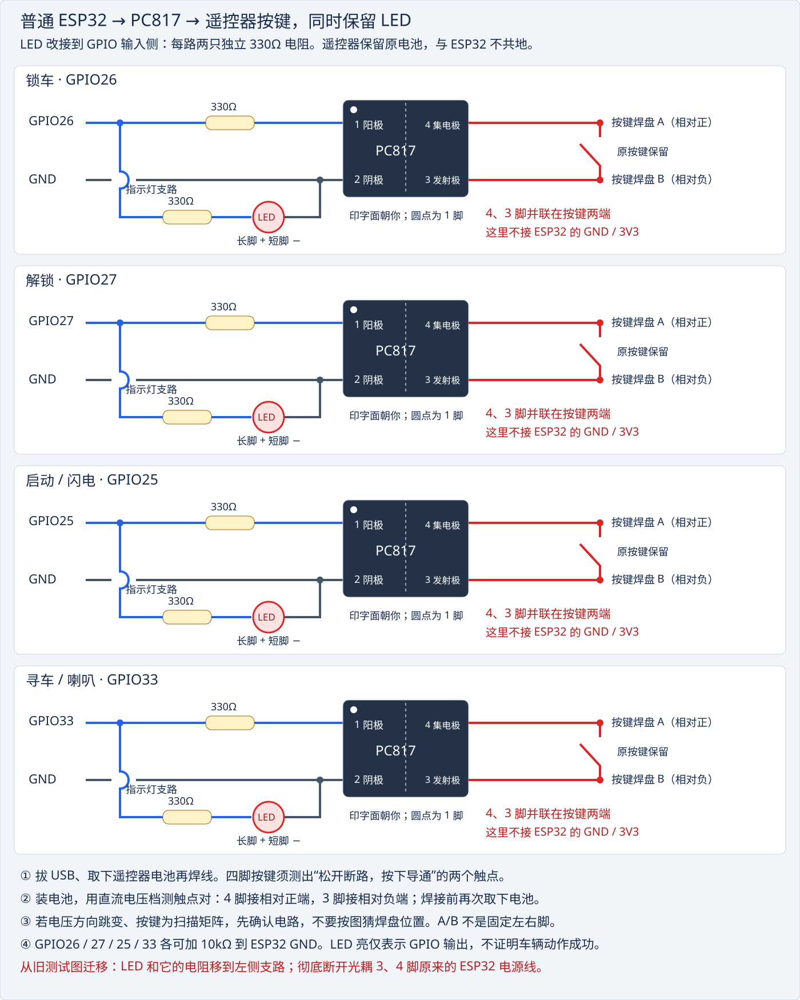
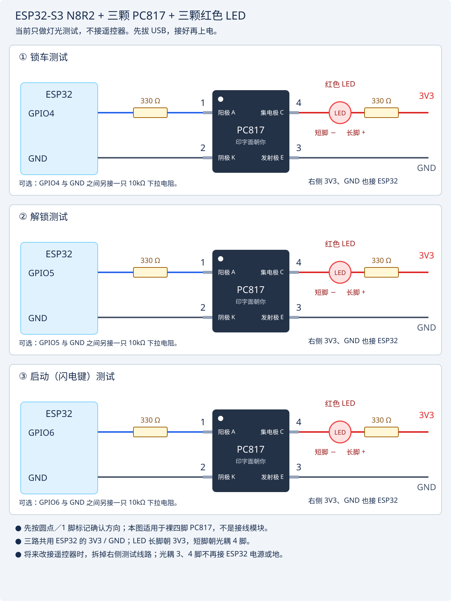

# ESP32 BLE 遥控器控制端

> **安全协议 v2（已部署到普通 ESP32）**：必须同时更新 ESP32 的 `main.py`、`security.py` 和小程序代码，保留原有本地配对配置。旧 HELLO/AUTH/CMD 明文协议已停用；下方历史调试记录中的旧协议不能用于新版。

ESP32 通过 GPIO 输出（ESP32-S3：4/5/6/7；普通 ESP32：26/27/25/33） 180 ms 脉冲，驱动四个光耦，模拟原车遥控器的锁车/解锁/启动/寻车实体按键。它不会读取、复制或重放射频编码；遥控器仍完成原有编码和发射。

## 接遥控器，同时保留 LED（当前接线图）

VS Code 按 **⌘⇧V** 预览。以下适用于裸四脚 PC817，GPIO 编号按板上丝印识别。

| 功能 | ESP32-S3 | 旧 ESP32 | 遥控器按键 |
| --- | --- | --- | --- |
| 锁车 | GPIO4 | GPIO26 | 锁车 / 设防 |
| 解锁 | GPIO5 | GPIO27 | 解锁 / 解防 |
| 启动 | GPIO6 | GPIO25 | 闪电键 |
| 寻车 | GPIO7 | GPIO33 | 喇叭键 |

每路 GPIO 分成两条并联支路：**GPIO → 330Ω → PC817 的 1 脚，2 脚 → ESP32 GND**；另一路 **GPIO → 独立 330Ω → 红色 LED 长脚，LED 短脚 → ESP32 GND**。不要让 LED 与光耦输入串联，也不要共用一个限流电阻。共需 4 颗 PC817、4 颗 LED、8 只 330Ω；建议各 GPIO 另加 10kΩ 到 GND。

**现有 LED 保留，但要从光耦输出侧移到 GPIO 侧。** 将光耦 3、4 脚原来接到 ESP32 GND / 3V3 / LED 的线路全部断开，再接遥控器；否则会破坏隔离。

### 圆形触点的测量方法与接线

照片中的每个按键由**中心圆点**和**外侧 C 形金属环**组成；按下时将两者接通。不能仅凭形状判断正负，也不能默认外圈是负极。

**本次用户实测：红表笔接中心、黑表笔接外圈，电压显示为正。因此已测按键的中心接 PC817 4 脚（集电极 C），外圈接 PC817 3 脚（发射极 E）。** 这里的“4 脚”是光耦脚号，不是 ESP32 GPIO4。该结论只针对已测触点，其他按键分别测量后再接。

1. **先断开 ESP32。** 遥控器只用原电池供电，不连接 ESP32 的 GND 或 3V3。
2. 万用表黑表笔插 **COM**，红表笔插 **VΩ**（不是电流插孔）；选择 **直流电压 V⎓**，量程高于电池标称电压，或使用自动量程。
3. 遥控器装好电池，按键保持松开。**红表笔接中心圆点，黑表笔接外圈 C 形环**。避免表笔同时碰到中心和外圈，以免模拟按键动作。
4. 根据下表确认接线。如果接近 0V、读数不稳定或正负跳变，先不要猜接，需要进一步确认电路或扫描方式。
5. 记录每个按键结果，**取下电池后再焊接**。两根线分别接中心和外圈，保留原按键；不要用焊锡把中心与外圈连在一起，也不要让线材妨碍原按键接触。

| 红笔中心、黑笔外圈时的读数 | PC817 4 脚（C）接 | PC817 3 脚（E）接 |
| --- | --- | --- |
| 稳定正数，例如 +3.0V（本次实测方向） | 中心圆点 | 外圈 C 形环 |
| 稳定负数，例如 −3.0V | 外圈 C 形环 | 中心圆点 |
| 接近 0V 或正负跳变 | 暂不接线，继续检查 | 暂不接线，继续检查 |

表中电压仅为示例，本次只确认了正负方向，未记录具体伏数。图中的 A 表示相对正端，B 表示相对负端；对本次已测按键，**A＝中心，B＝外圈**。三个按键各用独立 PC817，不能假定共用负端。LED 只证明 GPIO 发出指令，不代表光耦输出或车辆动作已经成功。

如果换成四脚机械按键：先取下电池，再用通断档找出“松开断路、按下导通”的两个有效触点；之后装电池，用直流电压档判断极性。**不要在带电时用通断档测量。**

PC817 脚号依据 [Sharp 数据表](https://www.learnabout-electronics.org/Downloads/PC817-optocoupler.pdf)。

旧版：仅 LED 测试接线图（不能直接并入遥控器）

这张旧图将 LED 接在光耦输出端，输出侧使用 ESP32 电源，仅供无遥控器时测试。接遥控器请改为上方新图。

## BLE 协议与使用

1. 在 ESP32 的 `pairing_config.py` 配置至少 32 字符的随机密码；用户在小程序密码框输入相同内容。密码不再放入小程序源码或安装包。
2. 小程序扫描 `ESP32-Car-Remote`，连接服务 `6e400001-b5a3-f393-e0a9-e50e24dcca9e` 后订阅状态特征。
3. 小程序订阅成功后写入 `HELLO`；ESP32 对该连接发送 `CHALLENGE:<nonce>`。小程序写入 `AUTH:SHA256(secret:nonce)`，收到 `AUTH_OK` 后才发送 `CMD:LOCK` 或 `CMD:UNLOCK`。

挑战码和认证状态均按 BLE 连接隔离；断开连接后认证立即失效。设备应安装在受保护位置，且不应把默认示例密钥投入使用。

## Wokwi

图中 旧 ESP32 的 GPIO 26/27 各接一只 330 Ω 电阻和 LED，方便观察短按脉冲；实物请以光耦代替 LED。

协议现在以换行符结束每条消息，双向每包最多 20 字节，固件与小程序必须一起更新。认证挑战使用随机数且一次有效；默认占位密钥拒绝认证；三路按键不能同时输出。手机按钮的“已发送”仅表示 ESP32 接受指令，不代表车辆已经上锁。

本地主机回归测试：`python3 remote-key-web-controller/tests/test_protocol.py`（仓库根目录）。
2026-09-19 已经通过串口读取实物为 ESP32_GENERIC / MicroPython 1.28.0；这不代表新固件已刷入或手机 BLE 已验证。

## ESP32-S3 N8R2 实机刷写记录（2026-09-19）

- 串口：`/dev/cu.usbmodem1411201`；芯片 ESP32-S3 revision v0.2。
- 实测 Flash 8MB；内置 Quad PSRAM 2MB，固件识别成功。
- 已刷官方 `ESP32_GENERIC_S3-20260824-v1.29.0.bin` 标准版（不是 Octal PSRAM 版），写入地址 0，Flash 大小设置 8MB，写入哈希校验通过。
- 原 Flash 备份保存在本机 `/Users/zzg/.local/share/esp32-backups/20260919-s3/original-flash.bin`，不应公开上传。
- 已上传本项目 `main.py`；S3 自动使用 GPIO4 锁车、GPIO5 解锁，初始电平均为 0。BLE 初始化、GATT 注册和重启自动启动已实机验证。
- 后续已配置两端本地配对密钥，GPIO4 的 PC817 + LED 三次脉冲测试已由用户确认；手机 BLE 配对仍在调试中，尚未验证遥控器。
- 固件来源：https://micropython.org/download/ESP32_GENERIC_S3/
- S3 引脚限制：https://docs.espressif.com/projects/esp-idf/en/latest/esp32s3/api-reference/peripherals/gpio.html

## VS Code 串口日志

打开仓库根目录，按 **⌘⇧B** 运行 `ESP32: 重启程序并查看串口日志`。任务会自动选择唯一的 Espressif USB 串口，软重启程序并持续显示日志。若上一次日志任务仍在运行，先在其终端按 Ctrl+C 退出，再按快捷键重新启动。日志同时保存在根目录 `simulation-logs/esp32-日期-时间.log`。按 Ctrl+C 退出监视，板上程序继续运行。刷写前先关闭此任务，避免串口占用。

只想监听、不重启时，在“终端 → 运行任务”中选择 `ESP32: 查看串口日志（不重启）`。默认快捷键的重启操作会断开 BLE；随后的 `KeyboardInterrupt` 是工具主动中断旧程序的预期输出，等到 `BLE ready` 即表示重新启动成功。

启动成功显示 `BLE ready: ESP32-Car-Remote`；手机连上显示 `BLE: connected`；收到握手显示 `BLE: HELLO received`；验证成功显示 `BLE: authentication OK`。日志不输出配对密钥、挑战码或认证摘要。

小程序日志在微信开发者工具的真机调试 Console 中，筛选 `[BLE]`。`openBluetoothAdapter:fail` 表示手机蓝牙初始化失败，还没开始扫描 ESP32；记录 errCode、errno、errMsg 和 permission/system 日志再判断原因。代码更新后需重新加载手机测试版本。

### 增强诊断日志

日志前缀 `[ESP32 t=...ms]` 使用板子的运行计时，外层 `[时:分:秒]` 是电脑接收时间。

| 日志 | 含义 |
| --- | --- |
| BOOT / GPIO_READY | 板型、固件版本、重启原因、GPIO 和初始输出 |
| PAIRING_CONFIGURED True | 已配置配对密钥（不显示密钥） |
| BLE_ACTIVE / GATT_READY | BLE 开启与服务注册完成 |
| ADVERTISE_STARTED | 广播启动调用成功；不代表手机已扫描到 |
| HEARTBEAT | 每 10 秒输出 BLE 状态、连接数、认证数、空闲内存和 GPIO 电平 |
| CONNECTED / DISCONNECTED | 手机建立或断开连接 |
| RX_FRAGMENT / HELLO_RECEIVED | 收到分包长度和握手，不显示内容 |
| AUTH_OK / AUTH_FAILED | 认证结果 |
| NOTIFY_FAILED | 通知发送失败及错误码 |
| BUTTON_ON / BUTTON_OFF | 输出开始及释放，仅表示 GPIO 动作 |

连接数持续为 0 表示当时没有手机连入，不等于广播故障。日志队列最多 64 条，满后记录丢弃数；按键输出期间暂停打印，避免串口打印延迟释放。查看旧的“BLE: ...”阶段说明时，以这里的大写事件名为准。

## 启动（闪电键）

小程序新增“启动 ⚡”，通过 `CMD:START` 模拟一次 180ms 短按；必须验证成功后才能操作，与锁车、解锁三路互斥。发送成功只表示 GPIO 接受指令，不代表车辆已启动。若实体闪电键需要双击或长按，需另外调整。

ESP32-S3：锁车 GPIO4、解锁 GPIO5、启动 GPIO6；旧 ESP32：26、27、25。第三颗 PC817 的 1 脚经 330Ω 接 GPIO6，2 脚接 ESP32 GND；3、4 脚并联接遥控器闪电键触点，LED 按顶部新图保留在 GPIO 侧，遥控器与 ESP32 不共地。

## 手机 ESP32 日志窗口

小程序下方新增可展开、清空的日志窗口，保留最近 100 条。独立通知特征 `6e400004-b5a3-f393-e0a9-e50e24dcca9e` 只向已通过配对认证的连接发送日志；认证后补发最近 30 条已处理日志，再持续推送心跳、连接及按键事件。不是完整串口输出或持久化历史，重启前的记录不会保留。

日志每包最多 20 字节，每个主循环每个连接最多一包；有按键输出时暂停日志发送。队列有上限，积压时丢弃新日志并报告数量。日志不含密钥、挑战码或认证摘要。日志订阅失败不影响控制通道。

固件和手机代码均需更新。固件新增 GATT 特征后需断开重连；手机若找不到日志特征，可退出小程序重新打开以重新发现服务。未连接时的底层启动异常仍需通过 VS Code 串口查看。

## 中文日志

设备日志已改为中文：连接、身份验证、运行心跳及按键操作均用中文说明；旧文档中的 BOOT / AUTH_OK 等名称对应旧版日志。点击按钮会依次看到“收到手机指令：锁车”“正在模拟按下【锁车】键，持续 180 毫秒”“【锁车】按键已释放，输出已关闭（车辆状态未反馈）”。不再显示每个通信分包，以免淹没有用信息。

本次需要重新编译手机小程序并断开重连：日志按整行拼包后进行 UTF-8 解码，避免中文在蓝牙分包边界乱码。ESP32 已刷入中文日志固件；手机实际显示仍需真机确认。设备计时是板子单调计时，软重启不一定清零。

## 四路洞洞板与 3D 打印外壳

[永久接线图、焊接步骤、STL 与装配说明](hardware-v1/README.md)。电池供电及实物尺寸仍需确认，第四路固件暂未实现。

## 随时可连接的省电配置

当前源码保持 BLE 持续可连接，不调用 `machine.deepsleep()` 或 `machine.lightsleep()`。启动时明确关闭 Wi-Fi 客户端及热点；未连接广播间隔由 500ms 调整为 1 秒，心跳由 10 秒调整为 30 秒。发现设备可能稍慢，连接后按键仍使用原有 180ms 脉冲与 20ms 主循环，日志功能保留。

这只是降低不必要活动，不等同于已启用 ESP-IDF 蓝牙 Modem-sleep 或自动 Light-sleep；这些功能依赖固件构建配置。若 Wi-Fi 原本关闭，这项不会额外省电。整板省电幅度和电池续航尚未测量，板载电源灯、稳压器也会耗电。

本次修改时未检测到 USB 串口，省电版仅保存到本地，尚未上传或完成实机连接验证。

## 安全加固 v2

- 一个连接占用一个认证会话；未在连接后 15 秒内通过认证会断开，重复握手不延长超时。
- 使用 HMAC-SHA256 验证随机会话挑战；每条控制指令绑定该会话、动作名称和递增序号，拒绝篡改、重复及跨会话重放。不接受旧明文 CMD。
- 错误认证/非法指令清除会话并断开；累计 5 次失败后限制新会话 30 秒。冷却也会暂时影响合法用户，不能保证抵御持续无线干扰或恶意抢占。
- 同一连接每秒最多接收 40 个写入分包；超过限制断开。单条消息最多 128 字节。
- 已认证连接连续 5 分钟没有有效操作会断开；重新连接即可。广播持续开启，不需要实体按钮唤醒。
- 日志仅向认证连接发送；状态特征不再提供匿名读取。日志不包含密钥、挑战码、认证码或指令签名。

### 协议格式

`HELLO2` → `CHALLENGE2:<32位随机十六进制>` → `AUTH2:<HMAC(secret, auth:v2:nonce)>` → `AUTH_OK`。

控制指令：`CMD2:<序号>:<LOCK/UNLOCK/START/FIND>:<HMAC(secret, cmd:v2:nonce:序号:动作)>`，序号从 1 开始；即使按键忙而未执行，序号也会被消耗，避免重放。消息仍以换行结束、每包最多 20 字节。

### 仍存在的边界

本版没有启用 BLE 加密绑定，HMAC 提供指令完整性与认证，不提供保密性；无线监听者仍可能看到操作与日志，主动实时中继也不在本版防护范围内。小程序已改为用户输入密码，不再包含配对密钥文件；密码通过 `wx.setStorageSync` 保存在本机，打开页面自动填入；清空输入框可删除，关闭页面不删除存储。设备端密码仍在 `pairing_config.py`，实体板访问者可能提取。旧测试包曾包含旧密钥，正式使用前应更换设备密码。不要把防重放称为完整车辆防盗系统。

若继续加固，需要设计设备密码修改入口和 BLE 加密绑定，并在实际 iPhone 上验证；不能直接启用未经验证的配对选项导致现有手机无法连接。

验证：`python3 -m unittest discover -s remote-key-web-controller/tests`；`node remote-key-miniapp/tests/security.test.js`。HMAC 按 RFC 4231 及 Python/Node 标准实现交叉校验。当前 USB 板子是普通 ESP32，仅有 boot.py；原 S3 不在当前串口，未宣称已部署或通过手机实测。

## 当前实机：普通 ESP32（2026-09-19）

已将 `main.py`、`security.py`、新的 `pairing_config.py` 安装到普通 ESP32，运行 MicroPython 1.28.0。蓝牙广播、GATT 服务和默认低电平已实机确认；HMAC 标准向量、认证、重放、超时测试通过。新密码独立于旧 S3，未写入文档和小程序包。

**当前接线：GPIO26 锁车、GPIO27 解锁、GPIO25 启动、GPIO33 寻车。** 顶部当前接线图已同步，原 S3 图另存为 `docs/pc817-remote-led-wiring-s3.svg`（位于固件项目）。保留四路独立光耦，遥控器不与 ESP32 共地。

串口 `/dev/cu.wchusbserial141120`；VS Code 日志工具支持自动识别 CH340/CP210x 及原生 ESP32 USB，存在多个候选串口时需显式指定。重新编译手机小程序，在密码框输入新密码再连接。手机实际操作尚待验证。

## 寻车（喇叭键）

小程序“寻车 🔊”通过签名 FIND 指令模拟一次 180 毫秒短按，必须先验证密码，四路按键互斥。普通 ESP32 使用 GPIO33，S3 使用 GPIO7。GPIO33 经 330Ω 接第四颗 PC817 的 1 脚，2 脚接 ESP32 GND；3、4 脚并联到遥控器喇叭按键的两个有效触点，按上面的测量方法判断方向。LED 保留在 GPIO 侧，并单独串联 330Ω。焊接前断开 USB 和遥控器电池。

需同步更新 main.py、security.py 和小程序代码；配对密码不变。发送成功只表示模拟按键，不代表车辆实际响应。实际喇叭键是否寻车、是否需要长按，应以原遥控器实测为准。
