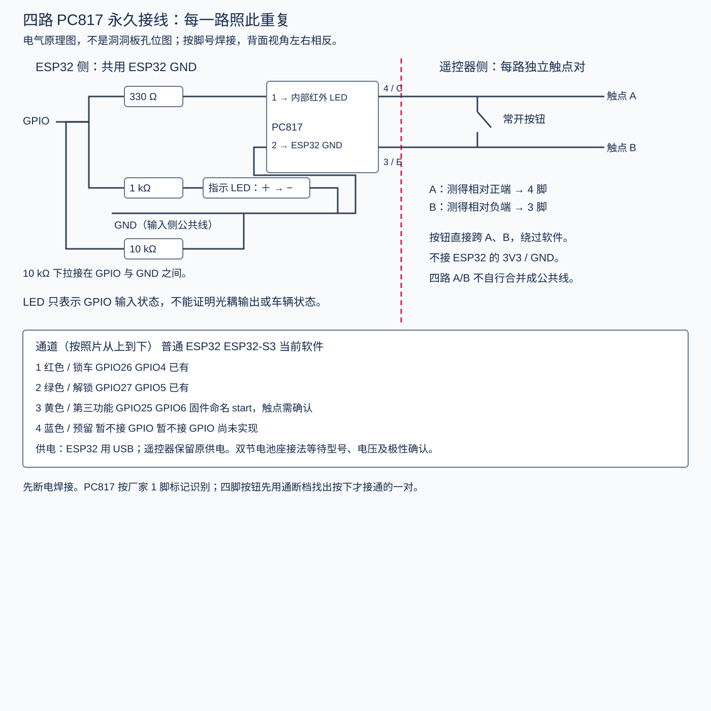
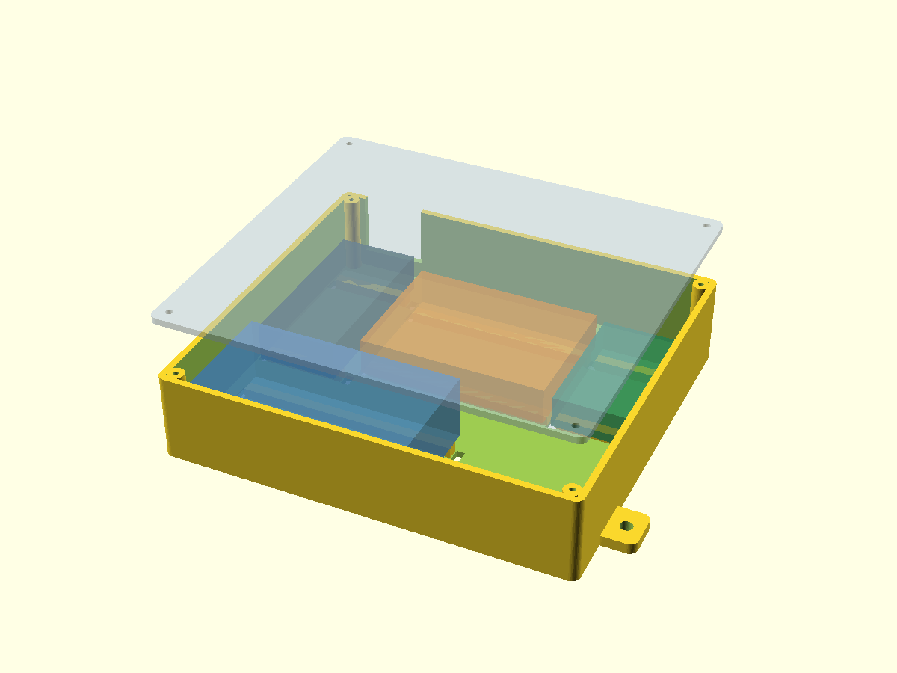

# 四路 PC817 洞洞板电路与打印外壳



此版依据最新照片：黑色长开发板、标注 5CM×7CM 的洞洞板、4 个 PC817、4 个 LED、4 个按钮。绿色遥控器裸板及双节电池座也预留空间。照片上的元件只有摆放，背面未焊，因此图是建议接法，不是现有线路复原。板上白色网格不是铜线连通证据。

## 永久电路，每路相同

| 连接 | 元件/端点 |
|---|---|
| 输入 | GPIO → 330Ω → PC817 1 脚 |
| 输入回路 | PC817 2 脚 → ESP32 GND |
| 指示灯支路 | 同一 GPIO → 1kΩ → LED 阳极；LED 阴极 → ESP32 GND |
| 上电下拉 | GPIO → 10kΩ → ESP32 GND |
| 隔离输出 | PC817 4 脚 → 遥控器有效触点 A；3 脚 → 触点 B |
| 手动操作 | 常开按钮两有效端分别接同一路 A、B |

红外 LED 和可见 LED 不能直接并联共用电阻。330Ω 光耦支路在 3.3V 下约 6mA（按约 1.2V 压降估算）；1kΩ 为低电流指示用途，不同颜色亮度不同，蓝灯可能较暗。GPIO 直接驱动方案需确认使用 3.3V ESP32 及其引脚能力。

**按钮直接操作遥控器，不经过认证和固件互斥，也不限制按下时长。** 默认上盖不开操作孔，以便开盖维护；如需外部手动操作，再实测开孔位置并确认此行为适合你。四路遥控器触点各自保留两根独立线，禁止根据猜测合并地线。

照片看起来有 7 只电阻，四路完整永久电路需要 12 只：330Ω×4、1kΩ×4、10kΩ×4。按万用表实测阻值确认，不能从照片可靠判定每只阻值。使用绝缘细导线，不要让输入与输出之间的背面锡桥跨接。

## 引脚与固件对应

| 通道 / 照片从上到下 | 普通 ESP32 | ESP32-S3 | 当前状态 |
|---|---|---|---|
| 红 / 锁车 | 26 | 4 | 已有固件通道 |
| 绿 / 解锁 | 27 | 5 | 已有固件通道 |
| 黄 / 第三功能 | 25 | 6 | 固件名 start，具体遥控器按键先核实 |
| 蓝 / 预留 | 暂不接 GPIO | 暂不接 GPIO | 固件未实现；输入通过 10kΩ 接地 |

最新照片 VP、VN、34、35 等丝印更像普通 ESP32。此为外观判断，不能替代实际芯片确认；不要对 S3 使用普通 ESP32 那一列。GPIO 编号不是物理针脚序号。本次没有修改固件或刷板。

## 按这个顺序焊接与检查

1. 拔掉 USB 和电池。用器件圆点/缺口及对应厂家资料确认 PC817 1/2/3/4 脚；从背面看，左右镜像，不要凭正面照片直接套背面孔位。
2. 每路先焊 330Ω→1 脚、2 脚→输入 GND。再焊独立 LED 支路、10kΩ 下拉。将每路 GPIO 输入引到独立端子，第四路只预留。
3. 用通断档识别四脚按钮：取松开断路、按下才通的一对。很多按钮同侧两脚已经永久相通，选错会一直短接输出。
4. 把按钮这两端与同一路 PC817 4/3 脚分别并联，引出 A/B。断电检查输入 GND 与任何 A/B 都不应有金属直连；按按钮时只有对应 A/B 接通。
5. 遥控器暂不接入。用临时测试负载 `ESP32 3V3 → 330Ω → 红色测试 LED → 4脚，3脚 → ESP32 GND`，一次测试一路光耦输出。该临时回路与永久输入指示 LED 不是同一支路。
6. 测试后完全拆除临时输出侧 LED/3V3/GND 接线。遥控器断电时识别按键触点对，恢复原供电后测 A/B 极性，4 脚接相对正端、3 脚接相对负端。若电压随扫描变动或极性不稳定，应先查清，不直接连接。原板的圆形触点需焊到实际铜焊盘/走线，不直接在碳膜接触面堆锡。

## 供电尚待电池信息

目前电路只确定 ESP32 由 USB 供电、遥控器保持其原电源且与 ESP32 不共地。双节电池座只做机械预留；照片不能确定电池化学体系、实际电压、电池座串并联及该板的电池接口功能。**不要把电池座直接接 3V3 或未知白色接口，也不要假定板载充电支持这组电池。** 提供电池标注/电压后再完成电源与开关部分。

## 外壳



[源文件](controller-case.scad) · [底盒 STL](case-bottom.stl) · [上盖 STL](case-lid.stl)

默认盒身 **150.8×134.8×34.8 mm**，含安装耳总宽 174.8 mm。这是保守的并排安装版，便于焊接和维护，没有把开发板压在洞洞板背面的焊点上。

| 区域 | 占位尺寸 mm | 依据 |
|---|---|---|
| ESP32 黑板 | 30×65×14 | 假设，含接口/焊点需实测 |
| 洞洞板 | 70×50×14 | 70×50 来自照片标称；厚度/元件高假设 |
| 遥控器裸板 | 30×50×12 | 假设，背面未知 |
| 双节电池座 | 80×40×24 | 假设，需实测装电池后的包络 |
| 可选电源小板空间 | 35×28×15 | 仅空间预留，无电源方案定型 |

底部支撑高 4mm；用绝缘垫和扎带固定，支撑条位置可在 SCAD 修改。支撑必须避开底部器件，扎带不能压遥控器触点。扎带穿底部槽，若安装面会压住扎带，安装时在安装耳下加垫片保持空隙。未猜测板上螺丝孔距。

USB 面向 +Y 壁，预留大线缆缺口，使用延长线，非精确插座配合。四角 M2.5 自攻螺丝（建议先试 M2.5×10），底盒孔 2.0mm、上盖孔 2.6mm；材料与打印机会影响配合。侧面安装耳 M4 通孔 4.5mm。

默认上盖不打 LED/按钮孔，因其精确中心和高度未测；可按实测启用 `access_holes` 并修改数组，圆孔仅是访问孔，没有会意外压住按钮的顶杆。当前并非带外部按键帽的成品。电池与电路天线之间也应留空，实测无线效果。

底盒平底朝下、上盖平面朝下分别打印。建议初始 0.2mm 层高、至少 3 圈外壁；按安装环境选择材料。无防水设计。先局部试印固定孔及支撑，测量确认后再印整盒。

## 验证与复现

`build_design.py` 生成 SCAD、SVG 与 `netlist.json`，并检查端子唯一性、输出网连接范围、SVG XML。它不是电路仿真或 PCB 布线验证。OpenSCAD 导出检查记录见本次交付；即便网格通过，也不代表实物适配。

```sh
openscad -D 'part="bottom"' -o case-bottom.stl controller-case.scad
openscad -D 'part="lid"' -o case-lid.stl controller-case.scad
openscad -D 'part="assembly"' --autocenter --viewall --imgsize=1200,900 -o preview.png controller-case.scad
```

资料：[Sharp PC817 数据表](https://global.sharp/products/device/lineup/data/pdf/datasheet/PC817XxNSZ1B_e.pdf)、[Espressif ESP32 GPIO 文档](https://docs.espressif.com/projects/esp-idf/en/latest/esp32/api-reference/peripherals/gpio.html)。
